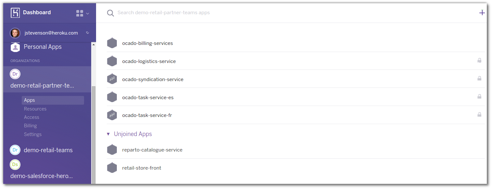
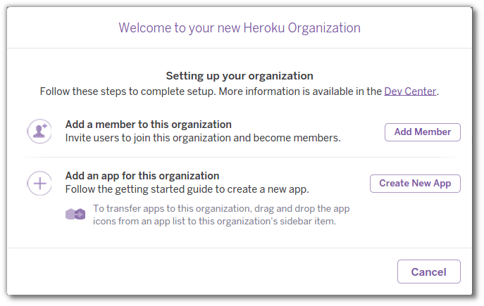
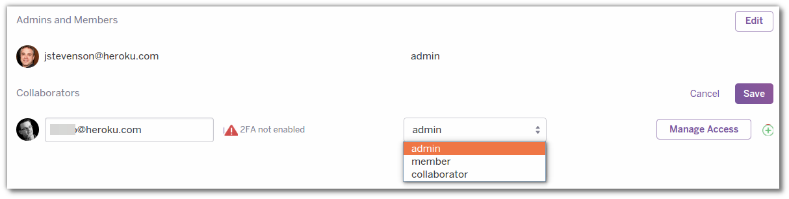
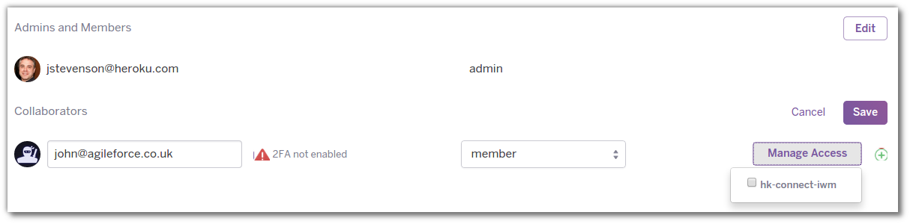

# Heroku Organizations

> **Warning** Organization Accounts are currently only available for purchase through our sales channel. Contact us if you would like to purchase an Organization Account.

  Organisations can help a business manage access and track resources used across all their Heroku applications.  Organisations are also really useful when a business works with external development agencies and contultancies.

  
  Heroku applications can be openly discovered and joined by those who are members of the Organisation.  Or you can selectively allow access to your Heroku apps by contributers of the organisation.
  

  Adminstrators can add new members, giving them full access, and remove departing members, ensuring the right people have access to your apps at all times.

  See the [Admin guide](https://devcenter.heroku.com/articles/create-manage-org) to manage your organizations, or [developer guide](https://devcenter.heroku.com/articles/develop-orgs) to learn how to work with applications in an organization.
  
  
