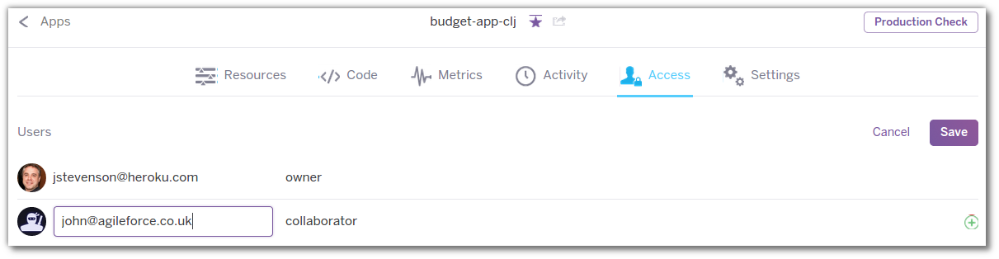

# Collaborating on Heroku Apps 

  Anyone with an Heroku account can be added to an Heroku app.  Once an account is added to an app, that developer can manage all aspects of that application.

  
  Heroku Organisations provide managemet and access over the collection of all your Heroku applications in your company.
  
  You can also collaborate around the codebase of your code with services such as Github and Bitbucket.  These services offer features specific to the management of code and can be used as part of your development workflow with Heroku.

