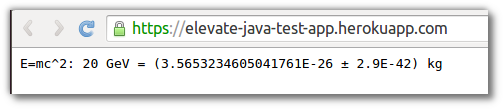

# Reading Configuration Variables from Code 

  Now you have seen how to set configuration variables, you need to know how to access them from your application. 
  
  In Java its a simple call to `System.getenv` to return the value.  This returns a string so you man need to convert it to an Integer value:
  
    Integer.valueOf(System.getenv("PORT"))

  Take a look at the sample Java app.  In the `src/main/java/Main.java` file you can see how the server is bound to the value 

```
    public static void main(String[] args) throws Exception{
      Server server = new Server(Integer.valueOf(System.getenv("PORT")));
      ServletContextHandler context = new ServletContextHandler(ServletContextHandler.SESSIONS);
      context.setContextPath("/");
      server.setHandler(context);
      context.addServlet(new ServletHolder(new Main()),"/*");
      server.start();
      server.join();
    }
```


> **Note** Add a configuration variable for energy conversion and update the code to use that variable

   First set the configuration variable on your Heroku app:

    heroku config:set ENERGY="20 GeV"

  We are going to use a library to calculate the value of energy, so edit the `pom.xml` file and add the following dependency
  
```
    <dependency>
      <groupId>org.jscience</groupId>
      <artifactId>jscience</artifactId>
      <version>4.3.1</version>
    </dependency>
```  

  Now edit the `src/main/java/Main.java` file.  First lets add some libraries

```  
    import static javax.measure.unit.SI.KILOGRAM;
    import javax.measure.quantity.Mass;
    import org.jscience.physics.model.RelativisticModel;
    import org.jscience.physics.amount.Amount;  
```
  
  Still in the `src/main/java/Main.java` file, edit the `showHome` method to calculate `E=mc^2` using the value from the ENERGY environment variable

    private void showHome(HttpServletRequest req, HttpServletResponse resp)
        throws ServletException, IOException {

      System.out.println("Calculating with Einstein");   

      // Energy is compatible with mass (E=mc2)
      RelativisticModel.select();
  
      String energy = System.getenv().get("ENERGY");
  
      Amount<Mass> mass = Amount.valueOf(energy).to(KILOGRAM);
      resp.getWriter().print("E=mc^2: " + energy + " = " + mass);  
    }

  Add the changes to your local repository and push those changes to Heroku.
  
```
    git add pom.xml src/main/java/Main.java 
    git commit -m "using configuration variable to calculate energy"
    git push heroku master
```  



---

## Alternatively...

> **Hint** All the changes above are also in a branch of the Git repository you initially cloned.  So, as an alternative to the above, you can checkout the branch `reading-configuration-variables` and merge it into the master branch.  Then push the change merged into master to Heroku.

    git checkout reading-configuration-variables
    git checkout master
    git merge reading-configuration-variables
    git push heroku master


