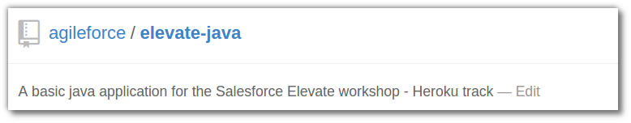
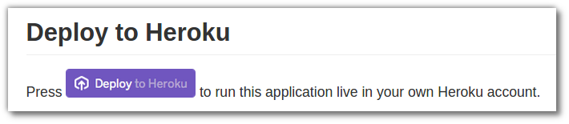
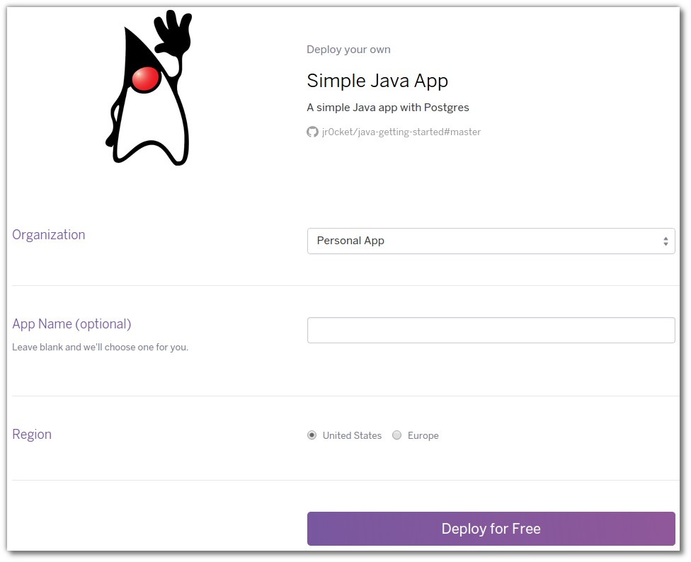

# Add an Heroku Button to the Sample App

> **Note**  In this section we will add an Heroku Button to the fork you took of the Java sample app. 

>   First lest make a copy of the Java sample application in your own Github account.  You can do this either by creating a new repository on Gihub and pushing the code from your laptop, or forking the original project.

## Either Fork the project on Github 

  To fork the existing project, visit the [Elevate Java repository on Github](https://github.com/agileforce/elevate-java) and press the **Fork** button in the top right hand corner.



  Clone the fork'ed repository, so you can edit the files locally on your computer
  
    git clone <your-new-repository-url>

  Change the alias used to refer to the original Elevate Java repository you cloned from.  Its common practice to use the **upstream** alias name to refer to a project you forked from.
  
    git remote rename origin upstream


## Or alternatively, create a new repository on Github 

  Create a new repository on Github by visiting your accound and selcting the **+** button and selecting **New Repository**  
  
  Add the address of the new repository to you local repository and push the code to Github.  The alias **origin** is a common name for the project that you created:

    git remote add origin <your-new-repository-url>
    git push origin master  


## Describe your application with app.json      

  App.json is a way of describing apps and any services they require to be deployed. requirements are. Heroku uses this file to figure out how code in a particular repo should be deployed on the platform. 
  
  Add the following description to a new `app.json` file in the project you previously cloned, substituting the _address of your repository_ on Github in the **"repository"** value:
  
    {
      "name": "Elevate Java app",
      "description": "A simple Java app from the Salesforce Elevate workhshop",
      "repository": "https://github.com/github-account/repository-name",
      "logo": "http://jr0cket.co.uk/play-heroku-workshop/images/java-duke-wave.png",
      "keywords": ["java", "maven"]
    }

 
  Now add the `app.json` file to your local repository 
  
    git add app.json


## Add the Button to your Github README.md 

  An Heroku button can live on any web page you like, although its common to simply add it to the `README.md` file in the Github repository that you want people to deploy.

  Edit the `README.md` file of the project and add the following to make an Heroku button appear in the `README.md` file:

```
[](https://heroku.com/deploy)
```

> **Comment** The Heroku button code works for any Github repository, its not hard coded to a specific URL. Then means that the Heroku Button will work correctly if the Github repository is forked.  Heroku resolves the repo originating a button click by inspecting the referer header. 


  Add the updated README.md file to local repository and commit both changes.  Then push those changes to your Github project:

    git add README.md
    git commit -m "adding app.json and heroku button to project"
    git push origin master

  If you visit your Github project page, you should now see the **Deploy to Heroku** button.
  


  When someone comes and presses your button, they will be shown the deployment screen:
  



> **Hint**  You can also use HTML code for the Heroku Button, for example if you want to include a button on a seperate web page.  You simply specify the address of the Github repository you want to deploy as a template value.  Here is an example:

```
<a href="https://heroku.com/deploy?template=https://github.com/github-account/repository-name">
  
</a>
```

> **Hint**  There is an [unofficial Heroku button generator](https://www.expeditedssl.com/heroku-button-maker) for a web form way to create buttons for your own projects.

--- 

## Alternatively...

> **Hint** All the changes above are also in a branch of the Git repository you initially cloned.  So, as an alternative to the above, you can checkout the branch `heroku-button` and merge it into the master branch.  Then push the change merged into master to Heroku.

    git checkout heroku-button
    git checkout master
    git merge heroku-button
    git push heroku master

You will still need to edit the `app.json` file and change the `repository` value to the address of your fork on Github.
