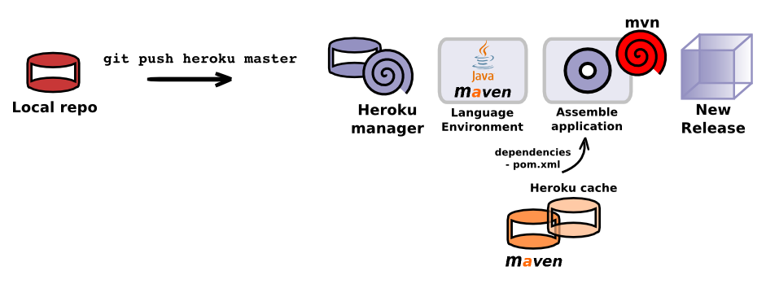

### Heroku behind the scenes

  Each time you push a new change (commit) to Heroku the following happens:
  

  
  * Git compresses the changes in your local git repository, so there is less data to send
  * Heroku repository unpacks the code and adds the new commits to its repository for your app 
  * Heroku detects what language your application is using and installs the relevant runtime and build tools
  * If your application has depenencies, they are pulled in from either the Heroku archive or standard repositories on the Internet.
  * Your application is compiled if neccessary (using what ever build tool your project uses)
  * A single file called a **Slug** is created, this is your complete application ready to be started
  * Any addons that provisioned by the buildpack are added to the Slug (ie. database)
  * Any configuration variables set for your app are added 
  * A dyno (a Linux container compute resource) is started and your Slug is loaded into the dyno.
  * Any processes defined in the `Procfile` for your project or processes defined in the buildpack for your langauge are started.

#### Addition details about Java apps

  More specifically in the case of a Java application, the established environment is OpenJDK and the Maven build tool is installed.  Maven then resolves the project dependencies and builds your source code into an app.
  

> **Info** Heroku has a mirror of many of the common dependencies used for each of its supported languages.  This mirror is used by buildpacks to speed up the deployment process.  

> Dependencies are also cached between deploys to save downloading the Internet on each deploy.

