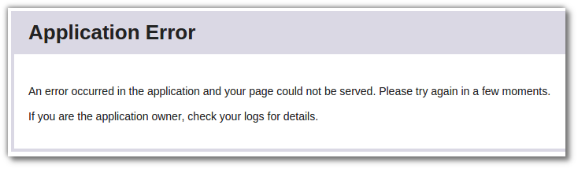
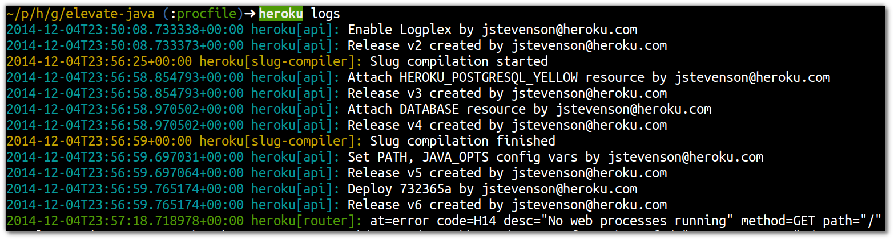
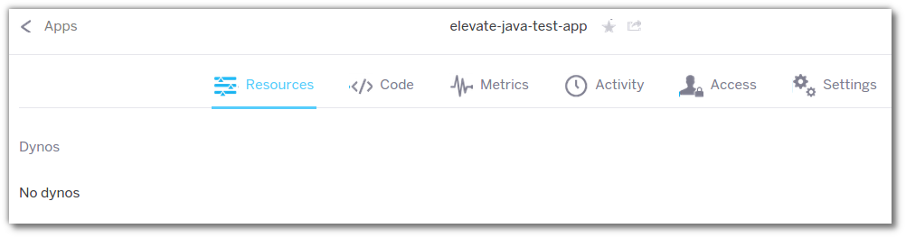

# Define the Application Process 

> **Note** View your application in the browser to see if it is working.

  Once your application is deployed, you can either enter the web address in a browser or use the Heroku Toolbelt to open the web page for you
  
    heroku open 

  In the browser window, instead of your shine new application, you will instead see an application error.
  

  So what is going on?  Our application deployed successfully, however its is not working.  Lets look at the heroku logs and see what is happening
  
    heroku logs 

  So from the Heroku logs we can see that although our application deployed, no actual process is running.  Therefore nothing is listening to our web requests.
  
  We can also see the effect of this in the [Heroku Dashboard](https://dashboard.heroku.com/).  Open your app in the dashboard and in the resource tab you will see there are no resources (dyno's) provisioned.
  

 As you may have guessed from the title of this section, we need to tell Heroku how to run our application.
 
 Create a file called `Procfile` in the root directory of your project (the same directory as the README.md file).  Edit the file and enter the following text
 
    web: java -cp target/classes:target/dependency/* Main

  Add the `Procfile` to your local git repository and push that change to Heroku.

    git add Procfile
    git commit -m "adding web application process in the Procfile"
    git push heroku master 

  A new version of your application will be deployed, this time with the web process defined.

> **Comment** The Procfile is a simple text file that lists all the process types that make up an application. Each process type is a declaration of a command that is executed when a dyno of that process type is started.

> The Procfile is the only Heroku specific file you add to your project in order to run on Heroku.  More details on the Procfile and Process types are covered in the [Process model](../process-model) section of this workshop.

---

## Alternatively...

> **Hint** All the changes above are also in a branch of the Git repository you initially cloned.  So, as an alternative to the above, you can checkout the branch `procfile` and merge it into the master branch.  Then push the change merged into master to Heroku.

    git checkout procfile 
    git checkout master
    git merge procfile
    git push heroku master

