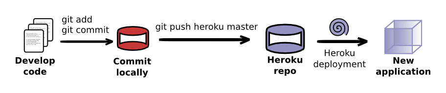
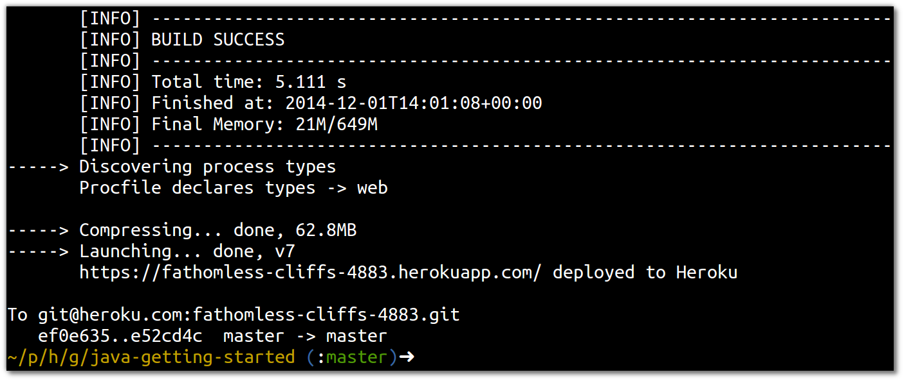
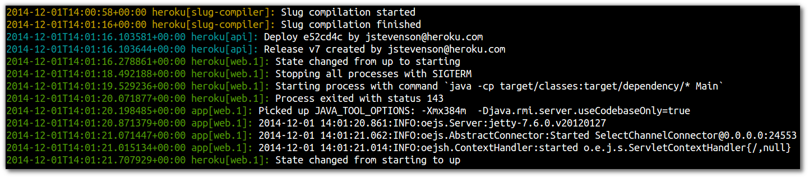

# Deploy a new change 

  Once you have created your application and deployed it on Heroku for the first time, you have a very simple deployment workflow for your projects.  Each time you make a meaningfull change to your project it is commited to your local  git repository.  When you have a one or more commits that you want to deploy, then you push them to the heroku git repository and the new version of your application is deployed.

You get into the following cycle:

    git add file(s)
    git commit -m "message"
    git push heroku master



## Modify your project

> **Note** To demonstrate this workflow around Git and Heroku, lets make a simple change to the new application.  As its simple you can just use any editor you want, you dont need to set up an IDE (although you can if you want).

In the source code file `src/main/java/Main.java` change the content of the response to be the following (we are only changing the text returned, so you can put in there anything you prefer):

```
  private void showHome(HttpServletRequest req, HttpServletResponse resp)
      throws ServletException, IOException {
    resp.getWriter().print("<h1>Hello from my wonderful Java app!</h1>");
  }

```
  Save the file.

## Commit your changes locally

  As you have made a change to your project, commit that change so that its under version control by git.

    git add .
    git commit -m "modified the default return message"


## Push your changes to Heroku

  Now the change has been commited locally, you can push it up to Heroku so your live application is up to date with your local app.

    git push heroku master

  This time the deployment should be quicker (half the time of the original deployment in the screenshot below).  Heroku caches dependencies between builds so the build tool does not need to download them again.



  Now the new version of your app is deployed, either refresh your browser that displays you live appliction or use `heroku open` from the command line.

> **Comment** If you want to understand more of what is happening to your running app during a deploy, you can open a second terminal window and run the command `heroku logs --tail`.



  Logging is covered in more detail in the [Understanding Logging](/understanding-logging) section.

---

## Alternatively...

> **Hint** All the changes above are also in a branch of the Git repository you initially cloned.  So, as an alternative to the above, you can checkout the branch `new-welcome-message` and merge it into the master branch.  Then push the change merged into master to Heroku.

    git checkout new-welcome-message
    git checkout master
    git merge new-welcome-message
    git push heroku master

