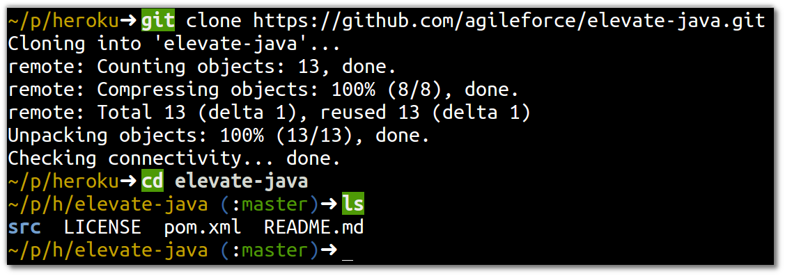
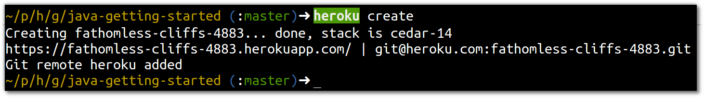
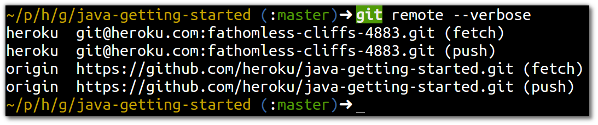
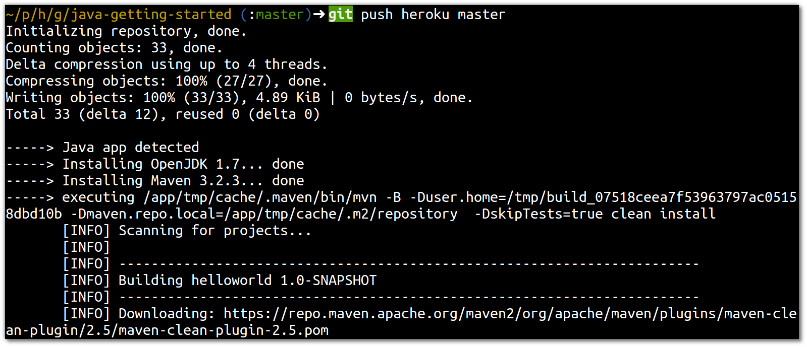
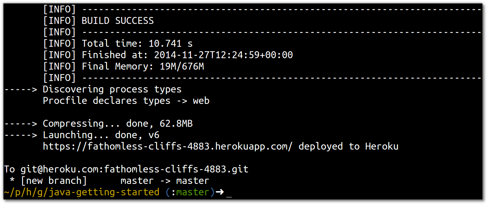

# Deploying initial Java app 
  
> **Note** Deploy the initial Java application from a Github repository

  Copy the source code to your computer using git:
  
    git clone https://github.com/agileforce/elevate-java.git

  Create a new App in your Heroku account
  
    heroku create

> **Comment** The name of your Heroku app will be different to the example above.  The name has to be unique across all Heroku as it forms part of the web address (URL) of your application.  You can of course use a custom domain with your application.

  The `heroku create` command also adds a connection to the Git repository for your Heroku app to your local Git repository 
  
  

  Finally, deploy the code from the sample app to your Heroku app using Git 

    git push heroku master

  Heroku detects the type of application (i.e. Java, Play, Node.js, etc) and pulls in the appropriate runtime, in this case OpenJDK 1.7.  Then Heroku installs the Maven build tool, so your Java application can be built.  Maven then proceeds to download the Internet for you.
  

  Assuming all the dependencies are resolved and the build is successful, the application is deployed onto Heroku 

