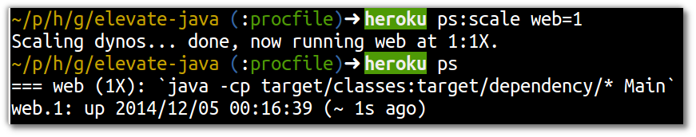
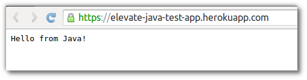

# Starting the Dyno 

  Although we have told Heroku how to run the process for our application, we may need to tell it to start a resource to run that process.  These resources are called Dynos.
  
> **Comment** A dyno is the name Heroku uses to represent the resources you can use to run you application.  Rather than use heavy weight virtual machines, your process is run in a lightweight container.

  So how to we start our dyno ?
  
  Using the Heroku Toolbelt, use the following command to start up 1 dyno to run our web process
  
    heroku ps:scale web=1

  Now our application is running and you can either refresh the browser window/tab or run `heroku open` to view the running application.
  

  Okay, so our application works although it does not do a great deal.  It is a base on which to develop and we know our deployment process works.

