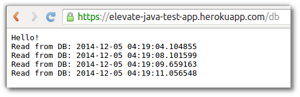

# Access Postgress from your application

> **Note** Add access the Heroku Postgress application from your application code.  Add the Postgress driver library to the project dependencies and code to create a table and read & write values
  
  Add the Postgres driver in the `<dependencies>` section of the `pom.xml` file 

``` 
      <dependency>
        <groupId>postgresql</groupId>
        <artifactId>postgresql</artifactId>
        <version>9.0-801.jdbc4</version>
      </dependency>
```

  Add code that reads from the database when you visiting a route on your application called `/db` (ie. when you access the application URL with /db appended to it). For example, if your app was deployed to https://wonderful-app-287.herokuapp.com/ then visit https://wonderful-app-287.herokuapp.com/db.

  Update the `Main()` method to return a result based on the URL passed as the request

```  
    public class Main extends HttpServlet {
      @Override
      protected void doGet(HttpServletRequest req, HttpServletResponse resp)
          throws ServletException, IOException {
    
        if (req.getRequestURI().endsWith("/db")) {
          showDatabase(req,resp);
        } else {
          showHome(req,resp);
        }
      }
```

  Create a method called `getConnection()` to access the database.  This method retrieves the environment variable DATABASE_URL set by the database add-on, and establishes a connection:

```
    private Connection getConnection() throws URISyntaxException, SQLException {
      URI dbUri = new URI(System.getenv("DATABASE_URL"));
  
      String username = dbUri.getUserInfo().split(":")[0];
      String password = dbUri.getUserInfo().split(":")[1];
      String dbUrl = "jdbc:postgresql://" + dbUri.getHost() + dbUri.getPath();
  
      return DriverManager.getConnection(dbUrl, username, password);
    }
```

  Create another method called `showDatabase()` to insert values into the Postgres database table called tick:

```
    private void showDatabase(HttpServletRequest req, HttpServletResponse resp)
        throws ServletException, IOException {
      try {
        Connection connection = getConnection();
  
        Statement stmt = connection.createStatement();
        stmt.executeUpdate("CREATE TABLE IF NOT EXISTS ticks (tick timestamp)");
        stmt.executeUpdate("INSERT INTO ticks VALUES (now())");
        ResultSet rs = stmt.executeQuery("SELECT tick FROM ticks");
  
        String out = "Hello!\n";
        while (rs.next()) {
            out += "Read from DB: " + rs.getTimestamp("tick") + "\n";
        }
  
        resp.getWriter().print(out);
      } catch (Exception e) {
        resp.getWriter().print("There was an error: " + e.getMessage());
      }
    }
```

The showDatabase method ensures that when you access your app using the `/db` route, a new row will be added to the tick table and all the rows will then be returned so that they can be rendered in the output.


Now when you access your app’s `/db` route, you will see something like this:



--- 

## Alternatively...

> **Hint** All the changes above are also in a branch of the Git repository you initially cloned.  So, as an alternative to the above, you can checkout the branch `database-access` and merge it into the master branch.  Then push the change merged into master to Heroku.

    git checkout database-access
    git checkout master
    git merge database-access
    git push heroku master
