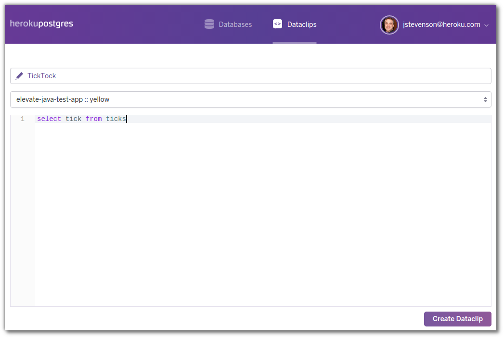

# Heroku Postgres Dataclips

  You can share and collaborate on database queries using [Heroku dataclips](https://dataclips.heroku.com/).  Just as you can share code snippets with Github Gists, you can share sql queries on your databases.  However, with dataclips you also see the results of running those sql queries and you can re-run those queries any time.
  
  You can also take your own copy of an sql query - fork it - and change it to suit your own needs, without changing the original query. 

> **Note** Create a new dataclip to see how many ticks you have in your database 

  First, view the resources tab of your application to see what your database is called.
  
  Then visit the Heroku dataclips dashboard and select **Create Dataclip**

  Enter the name of the dataclip, select the database and write the sql query you want to run on the database.  
  
  
  
  Select **Create Dataclip** again and the query will be run against the database and return the result
  
  

--- 

# Example dataclips 

Lets look at the query that drives the data clip 

Share a dataclip 

Example list of dataclips 

<!-- 
Example data clip from Heroku 
https://dataclips-next.heroku.com/yamijuevuboyfdxziyjkpqwxqtdf
-->
