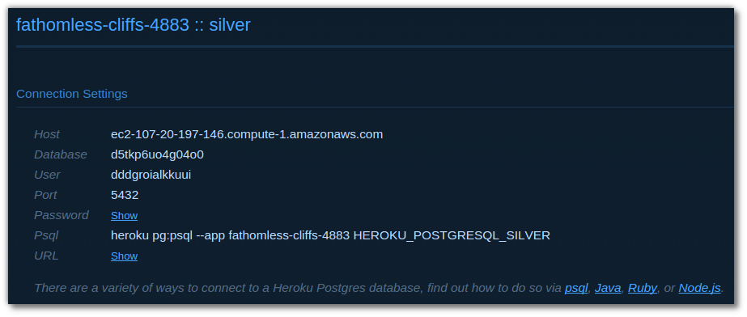
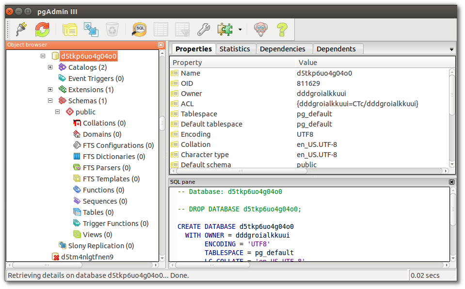

# pgAdmin graphical Postgres client

  A common tool for Postgres administration tasks is [pgAdmin](http://www.pgadmin.org/).
  
> **Note** Connect to your Heroku postgres database using the pgAdmin tool 

  Install pgAdmin by following the instructions on the [pgAmdin download page](http://www.pgadmin.org/download/). 
  
  View your database connection settings by visiting the **Resource** tab of your application in the Heroku dashboard.  Click on the Heroku Postgress addon name to open its dashboard view.
  

  
  Run the pgadmin3 tool and add a server connection using the Heroku Postgres details from your app.
  

  Once the server is added you can see the databases on that server

  Find your database and select it:
  

  Open the SQL editor to run queries on the database directly:
  

  Run the following sql command in the editor to see all the ticks in your database 
  
    select tick from ticks;

> **Comment** If the sql query returns no results, visit the website of your application and add `db/` to the end of the address.

