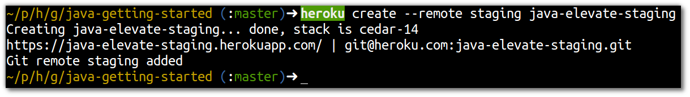

# Create a Staging Environment for your App

> **Note** Create a second environment for the app, called Staging.  This environment is typically used for performance testingand to catch any final issue before deploying a new version to production.

## Create the environment 

  Check for addons 
  
    heroku addons

  If there are addons attached to your existing Heroku app, then you will need to add them to the new Heroku app you are creating.  If you have a number of addons, you can pipe the results of the `heroku addons:list` to a file

    heroku addons > my-app-addons.txt

  Now provision a new Heroku app from the same code base, making the staging environment
  
    heroku create --remote staging my-app-staging 

> **Comment**  The `--remote` option allows you to defined the alias name used for the remote Git repository on Heroku.  Again, you can use what ever naming convention works best for your team.
  

## Pushing to the Staging Environment

  As you have a single code-base for your app, shared between all your environments, you simply push the version you want using Git:
  
    git push staging master

> **Comment** Dont forget to add the same addons you provisioned on the original Heroku app.  In the workshop examples, we do not have any extra ones as the Heroku Postgres database is added during the first deployment.
