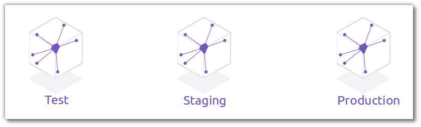
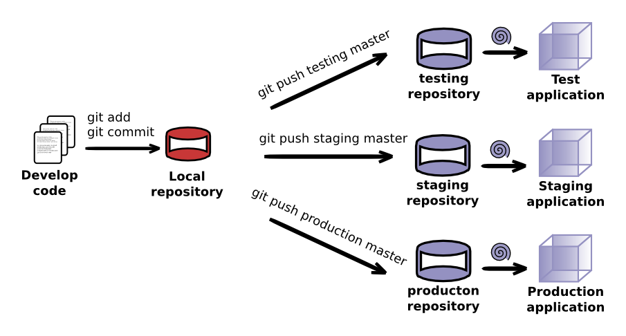

# Establishing Multiple Environments 

  For many projects you will want to test your application as a working website or service before actually deploying it to production.  You may also need to have several environments to satisfy company policy.  It is a simple matter to create additional Heroku Apps that are deployed to from the same codebase, easily establishing multiple environments.

## Creating more environments

  To create more environment you simply create a new Heroku app from the same codebase / project.  Each new app is typically called the app name with the environment name tagged onto the end.

    heroku create --remote environment my-app-environment

> **Info** The `--remote` option specifys the alias name used for the remote Git repository on Heroku.  

  To deploy  when you push your code to these environments you use the commands:

    git push environment master

> **Comment** There is no specfic naming convention required by heroku, although the above names are commonly used.  Use a naming convention that works for your organisation.  See the Heroku article on [multiple environments](https://devcenter.heroku.com/articles/multiple-environments) for more information.

# What environments should you create ?

  Some development workflows call for a one or more environments outside production.  Most developers consider their own system the development environment, however a test and staging environments are also very common as applications get bigger and more connected.  So you could create one or more of the following environments:  
  
  * my-app-dev
  * my-app-testing
  * my-app-staging
  * my-app-qa
  * my-app-production-support
  * my-app

  As you have seen it is very easy to create multiple identical environments using heroku, all from within the same project you have already created.  You can use any naming convention you like, so long as the names used are unique across the whole of heroku.  By using a unique project name on heroku, you can simply add the environment to the end of the name.  Typically you leave the production environment name off and symply call it my-app.

> **Hint** Heroku as a labs feature called [Pipelines](https://blog.heroku.com/archives/2013/7/10/heroku-pipelines-beta) that lets you define the relationship between environments and promote the app (slug) from one environment to another.

