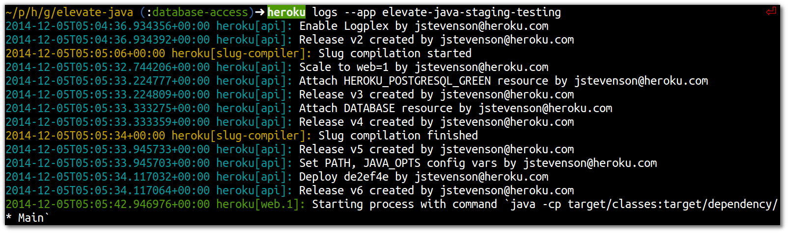

# Managing multiple environments

  Now you have two Heroku apps, you will need to use the `--app` or `-a` option when using commands from the Heroku toolbelt.  for example:

    heroku logs --app my-app-staging --tail
    heroku ps:scale web=2 --app my-app-staging 
    heroku run bash --app my-app-staging 

> **Note** Try viewing the logs from the different environments that you created.

    heroku logs --app my-app-testing --tail
    heroku logs --app my-app-staging --tail
    
    heroku app:info -a my-app-testing 
    heroku app:info -a my-app-staging 
    

