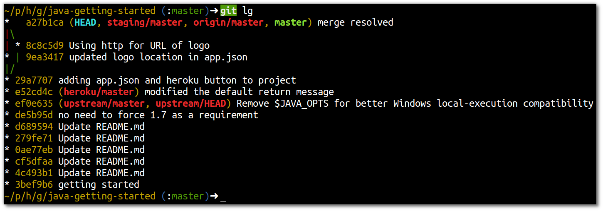

# Tracing deployment with Git Log

  Git log has a visual represtentation of changes called the graph.  The graph can show where changes have been committe across different branches.  The graph can also show which commits have been pushed to the remote repositories added to the local repository.
  
  So using Git log you can see quickly see what changes have been pushed across all your environments 

> **Note** Use `git log` to see which commits have been deployed across all the environments (Heroku apps) you have created so far (or if you are using a Graphical tool for git, look for a graph view of the Git log)

> Create some additional commits locally and push them through your environments, each time checking `git log` to show the progress.

  To see `git log` present its output in graph representation, use the following command:

    git log --oneline --graph --decorate

> **Comment** The `--oneline` option show just the essential commit information all on one line.  The `--graph` option shows a visual representation of the commit history, including branching and merging.  The `--decorate` option shows where each branch, tag and repository name against their most current commit.

--- 

> **Hint** You can [create an alias for git log](http://jr0cket.co.uk/2013/01/git-log-makes-multiple-repos-easier-to.html.html) on the command line with the options you regularly use, to make the command easier to use.

