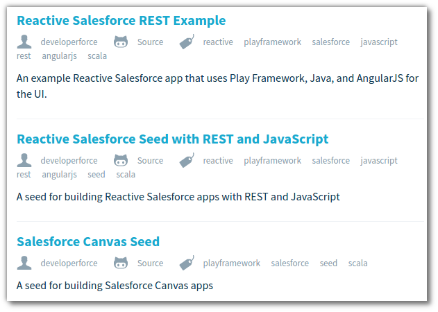

# A new Play Framework App 

> **Info** This section requires Play Frameworks to be installed locally on your laptop.  If you want to develop this application in greater depth, then an IDE such as IntelliJ is recommended.  

> If you do not wish to work with Play you can explore some of the other Heroku sample apps, deploy your own project or find an Open Source project you would like to try out.

  You can either develop your own Play Framework app, or use one of the [Salesforce Templates](http://typesafe.com/activator/templates#filter:salesforce) as a starting point.

## New App workflow 

  Creating a new app is no different from the workflow we have already used, except of course you are creating your app from scratch.
  
  * Create a new app (using a template)
  * Put the project under Git version control
  * Develop the app & commit changes locally 
  * Create an Heroku App for your application
  * Push app to Heroku when you want to share 
  
> **Note** Choose one of the [Salesforce Templates](http://typesafe.com/activator/templates#filter:salesforce) as a starting point.

> Instructions on how to configure the Play app and Salesforce Org are included in the project.
