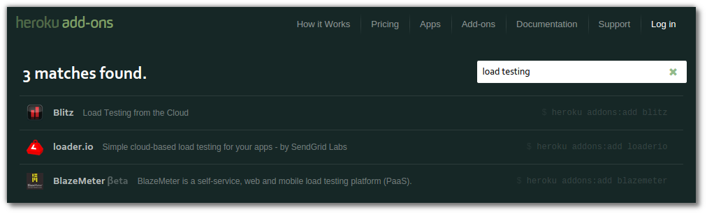

# Heroku Metrics 
  
  Heroku Metrics system is designed to make it simple for you to analyze and optimize performance of your applications on Heroku.  It provides a unified view of the data most relevant performance characteristics:

  * **Throughput**: requests per minute segmented by HTTP status codes (OK vs. Failed) per time period.

  * **Response Time**: both the median and 95th percentile response times per time period.

  * **Errors**: platform error codes are interpolated with the rest of your time series data for better understanding of causality.
  
  * **Memory**: visualise the memory utilization to assessing capacity, find memory leaks, or identify performance degradation due to swap.
  
  * **CPU Load**: track load especially when processing intensive workloads, or running high levels of in-process parallelism.

> **Comment** Metrics requires two or more dynos to be running on your app.  You also need to run your application on load for a while to build up metrics data.

> There are load and stress testing services available at [addons.heroku.com]()

