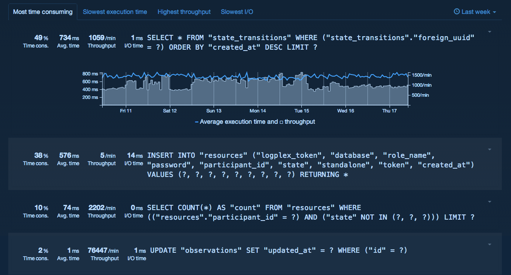
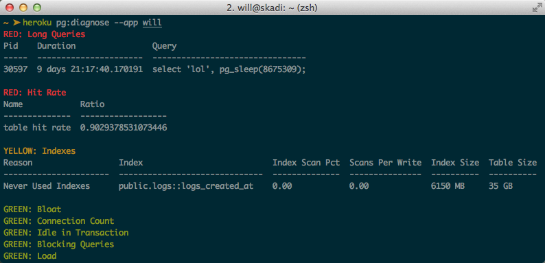

# Heroku Postgres Metrics 

  Performance Analytics allows development teams to quickly and easily identify the queries that most impact database performance. We call these expensive queries. Often, simply adding the right index or more aggressively caching data can make enormous improvements to performance. But it can be difficult for teams to identify which queries are most affecting performance and worth the effort to improve. Further complicating optimization is the fact that looking at queries at a single point in time lacks the necessary context to understand the problem.

#### pdgiagnose
pg:diagnose is a new tool for finding and fixing performance issues with your Heroku Postgres database. 

The heroku pg:diagnose CLI command unlocks the wealth of built-in information that PostgreSQL stores about its own health and performance, presenting it in simple report that makes identifying and correcting common database problems effortless.

  At Heroku we have build up a large amount of experience with how Postgres behaves by running our own fleet of Postgres systems and for a great many customers. 
  
  Let’s take a look at a sample pg:diagnose report:
  

> **Comment** More complex queries will need to be written that we have in our workshop application to show how useful these postgres diagnostics are.
