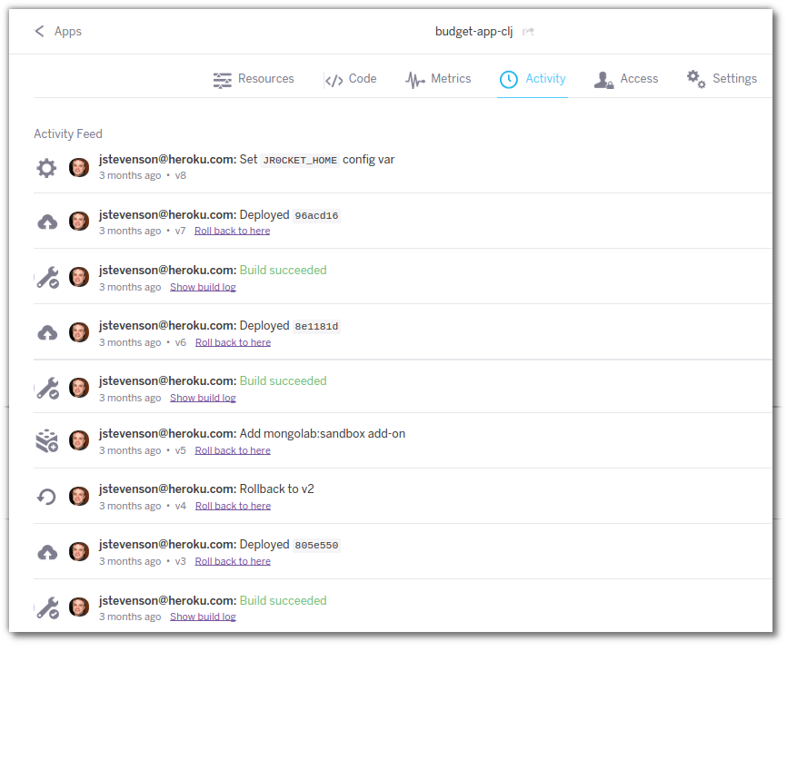
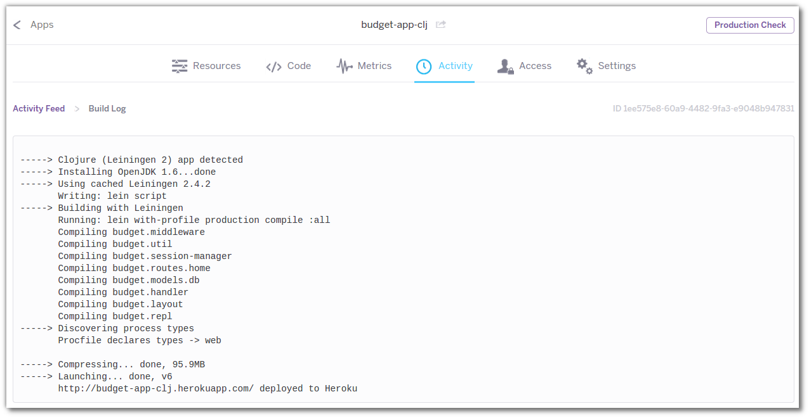

# Heroku Dashboard Activity Log 

  Heroku Dashboard has a section called Activity that shows a feed of all the information around your app, including
  
  * the build process 
  * adding config vars
  * provioning addons 
  * release and rollbacks

  There is a **rollback to here** link on every release in the activity feed. 

#### Viewing the build log

  For the build tasks in the Activity feed, You can drill down into the build log to see the steps Heroku went through to deploy your app.  This can be useful information to help you decide which release to roll back to.
  

