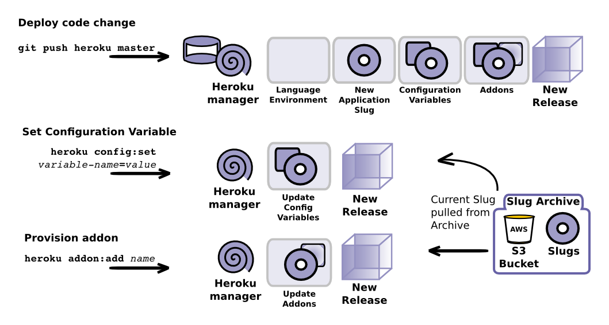

# Releases & Rollbacks

  As its so quick and easy to deploy to heroku it is a great platform for continuous deployment. 
  
  Typically there are many releases of your application, so Heroku gives you a very easy way to see what releases have been made.  As software development is still a human activity then errors are inevitable, so Heroku provides an effective way carry out rollbacks to keep your site live.

  An application rollback can be done in seconds, allowing time for a root cause analysis of any issues that occur with a new release.  Once the cause of issue has been identified it can be fixed locally and pushed to Heroku as a new release. 

#### What is a release

  A release is composed of 

* a Slug - the assembled application, ready to be run on a dyno
* all Configuration Variables for your application

#### What triggers a new release

  It is important to understand what triggers a new release on Heroku.  As well as using `git push` for deploying a new version of your app, the following actions also create a new release.
  
* Updating configuration variables, eg. `heroku config:add DB_URL=https://postgres.heroku.com/ofipie8ufdhh`

* Provisioning an Heroku add-on, eg. `heroku addon:postgres`

* A Rollback - switching to a previous release if there is an issue with the latest release.

