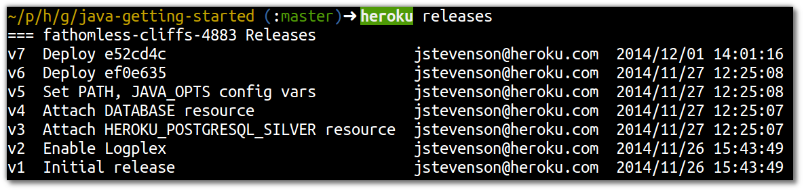
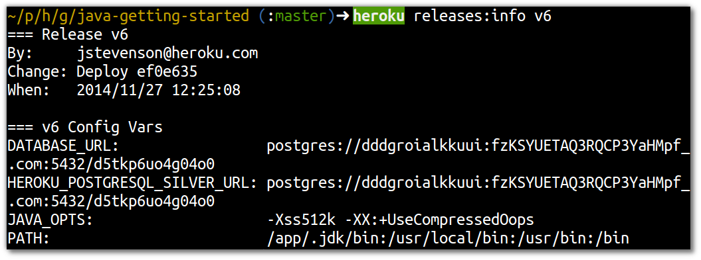
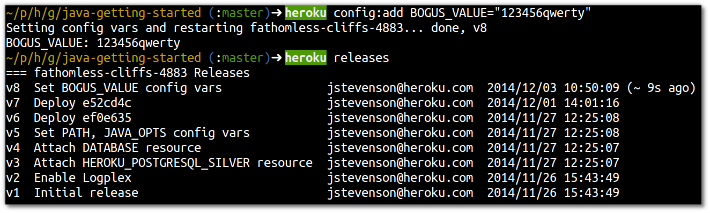
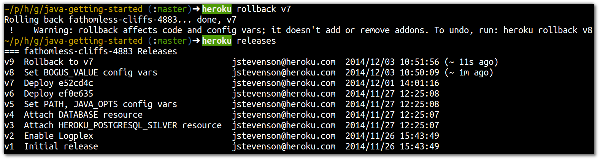

# Releases & Rollbacks via the Heroku Toolbelt

> **Note** View the releases for your application.  Then create a new release and rollback that release.

  To see your current list of releases for your application, use the following command within your project folder:

    heroku releases

  You should already have several release for your application, even if you have only done one or two pushes.  When you created your application uisng `heroku create` then several releases took place automatically.

  Your release history should look similar to the following:
  

  
  Notice that each relase is related to a commit number used in Git.  This commit number gives you traceabitliy between your version control system and your deployed appliations.
  
  You can also dig deeper and see more details about a specific release version using the following command: 
    heroku releases:info v24

---

> **Note**  Create a new release by either changing the code or adding a new configuration variable.  
  
    heroku config:add BOGUS_VALUE="123456qwerty"
  
  View this new release using `heroku releases`.

  
  Now rollback from this new release to the previous release using the command (assuming the previous release is v7):
  
    heroku rollback v7

  Look at the release history again, `heroku releases` and you will notice that the rollback actually creates another release, indicating which release it has come from.  This makes is very easy to understand the state of your application.
  

