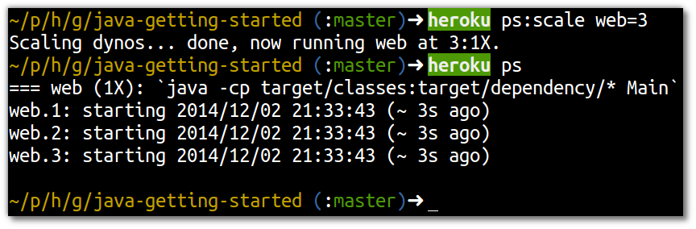

# Scaling apps via the Heroku toolbelt 

> **Note** Scale the dynos for yor Heroku application using the toolbelt.  At the same time, view the live Heroku logs so you can see exactly what is happening.

  First, check how many dynos are running using the Heroku toolbelt:

```
    heroku ps 
```


  Now scale your application to run 3 dynos

``` 
    heroku ps:scale web=3
```



  In the Heroku logs you can see additional web processes being provisioned automatically.  The new dynos come almost instantly and are fully active as soon as your application process has started.  


> **Comment** The faster you application process starts, the faster you get new dynos.


  Now scale down your application back to 1 dyno: 


  You can see how quickly the excess dynos are shut down, again affected by how quickly your application exits.


### Resizing your dynos 

  You can resize to a larger or smaller dyno type using the toolbelt.
  
> **Warning**  Remember that larger dynos will use up your monthly free credits faster, so dont forget to resize down and set your dyno usage to zero.

```  
  heroku ps:resize web=2x
```


  Now scale down the dyno back to the original 1x size

```
    heroku ps:resize web=1x
```


  Finally, scale your dynos down to zero:
  
    heroku ps:scale web=0


