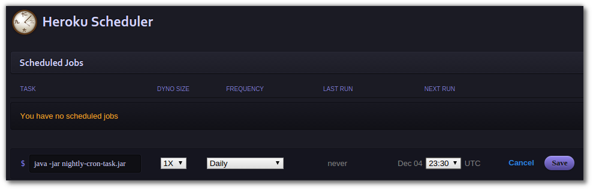

# Heroku Scheduler 

  Scheduled jobs should be short running tasks, of no more than a few minutes. Anything that takes longer should be queued and processed be a worker dyno type.
  
  Jobs running longer than their frequency are terminated. So a job scheduled every 10 minutes will be terminated after running for 10 minutes.

  Dyno hours from Scheduler tasks are counted just like those from `heroku run` or other dynos. They will appear with a “scheduler” dyno type in your Heroku invoice.

#### Scheduling jobs

To schedule a frequency and time for a job, open the Scheduler dashboard by clicking on the Scheduler addon in the Resources tab of the dashboard. Scheduler can also be opened from the command line:

    heroku addons:open scheduler

On the Scheduler Dashboard, click “Add Job…”, enter a task, select a frequency, dyno size (1X or 2X), and next run time.

> **Comment** The scheduler runs in the UTC timezone. If you want to schedule jobs in your local time, add the UTC offset for your timezone.





> **Hint** Instead of specifying the command, you can specify a process type. The command associated with the process type will then be executed, together with any parameters you supply. See the [syntax for one-off dynos](https://devcenter.heroku.com/articles/one-off-dynos#one-off-dyno-execution-syntax) to learn more.


#### Logs for scheduled jobs

  Use the Heroku toolbelt command `heroku logs` and you can see `scheduler.X` labelled messages when your scheduled task runs.  To make it easier to see the scheduler messages, use the `--ps scheduler.X` filter, where X is the dyno number of the scheduler

````
$ heroku logs --ps scheduler.1
2011-02-04T14:10:16-08:00 heroku[scheduler.1]: State changed from created to starting
2011-02-04T14:10:16-08:00 app[scheduler.1]: Starting process with command `bin/clean_sessions`
2011-02-04T14:10:19-08:00 app[scheduler.1]: Deleting stale sessions...
2011-02-04T14:10:27-08:00 app[scheduler.1]: done.
2011-02-04T14:10:28-08:00 heroku[scheduler.1]: State changed from up to complete
The scheduled dyno is also visible with the heroku ps command:
$ heroku ps
=== scheduler: `bin/clean_sessions`
scheduler.1: complete for 5m

=== web: `bundle exec thin start -p $PORT -e production`
web.1: idle for 3h
Long-running jobs
```


> **Warning** Scheduler is a best-effort service and is therefore not suitable for production systems.  An alternative to Heroku Scheduler is to [run your own custom clock process](https://devcenter.heroku.com/articles/scheduled-jobs-custom-clock-processes).  Also see the [Java & RabbitMQ example](https://devcenter.heroku.com/articles/scheduled-jobs-custom-clock-processes-java-quartz-rabbitmq).
  
  
