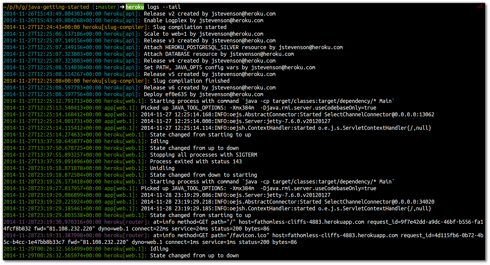

# Understanding Logging 

  Heroku uses a unified logging approach for your Heroku app called [Logplex](https://devcenter.heroku.com/articles/logplex).  This means that all the logs from your application, Heroku API and Infrastructure is in one continuous stream.  Having all the logging information in one place in time-order makes diagnosing an issue much faster and it is easier to understand the root cause of the issue.

  To see the unified logs for your application, use the following command:
  
    heroku logs
  
  When you want to drill down into a particular area, say just your application logs, then you can use one of the following options to fillter out the other messages. 
  
  * `--source app` - logs generated from within your application, application server and libraries.

  * `--source heroku` - actions taken by the Heroku platform infrastructure on behalf of your app, eg. restarting crashed processes, sleeping or waking a dyno, serving an error page due to a problem in your app.
  
  * `--source heroku --ps api` - actions taken by developers & tools working on your app, eg. deploying new code, scaling dynos, toggling maintenance mode.
    

> **Comment**  It is important to understand how to write logs from your application to the Heroku Logplex, so this section will show you how.  

## Log format 

  Each line of the Heroku Log is formatted as follows:

    timestamp source[dyno]: message

  * `timestamp` -  date & time recorded, according to the dyno or component. The timestamp is in [RFC5424](http://www.rfc-base.org/rfc-5424.html) format and includes microsecond precision.
  
  * `source` - where the log message has come from (see the sources above)
  
  * `dyno` - name of the dyno or component that wrote this log message. For example, web dyno number 3 appears as `web.3`, the Heroku HTTP router appears as `router`.
  
  * `message` - the message itself, split every 10,000 bytes and submitted as a separate log line.

