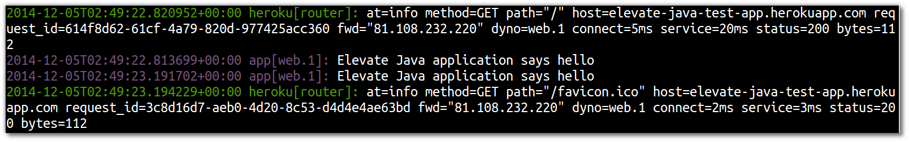

## Application Logging

  To write to the unified Heroku logs (Logplex) from your application, simply write to standard out (`stdout`) or standard error (`stderr`). This makes it easy to log from anywhere in your application code with a simple output statement.

## Java applications 

  In your Java application code you can use the `System.out` and `System.err` calls to push messages to the Heroku unified log

```
System.out.println("Hello, this is a general log message");  
System.err.println("Error: Something has gone wrong!");
```

> **Note** Add the following standard error to the Java application  

```
    private void showHome(HttpServletRequest req, HttpServletResponse resp)
        throws ServletException, IOException {
      System.out.println("Elevate Java application says hello"); 
      resp.getWriter().print("<h1>Hello from my wonderful Java app!</h1>");
    }
```

  See the log message appear by visiting your web application whist running the Heroku logs
  
    heroku logs --tail 



--- 

## Alternatively...

> **Hint** All the changes above are also in a branch of the Git repository you initially cloned.  So, as an alternative to the above, you can checkout the branch `logging-from-app` and merge it into the master branch.  Then push the change merged into master to Heroku.

    git checkout logging-from-app
    git checkout master
    git merge logging-from-app
    git push heroku master


