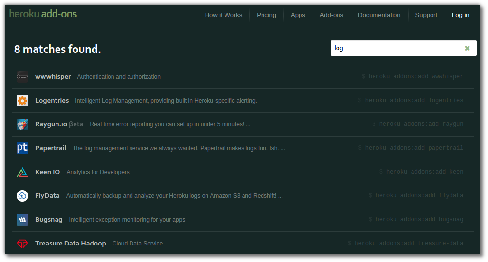

## Long term logging

  Heroku Logplex is designed for high performance, therefore it only stores 1500 lines of logs for every one of your applications. 
  
  If you need to keep you logs around for more time (required if working in a highly regulated industry), the full log stream is [available as a service](https://devcenter.heroku.com/articles/logging#syslog-drains) so you can connect it to any existing logging or monitoring service you use.  
  
  There are also [several logging services available via Heroku Addons](https://addons.heroku.com/?q=log) which provide log persistence, searching, condition based alerts, analytics, etc.  
  

  
  If you are experiencing performance problems, having the logs around can help highlight issues with your application.  Intermittent problems are particularly hard to find, so this may require looking for patterns over a longer period of time.
  
  Running anaysis and reporting tools over your logs can also give you insight into your customer activitiy and relavite performance of your application.  This information can be used to help you scale your application appropriatly.  Remember that you can scale down your app just as easily as scalling up and the benefit of a cloud platform is that you do no need to pay for resources you dont want.

