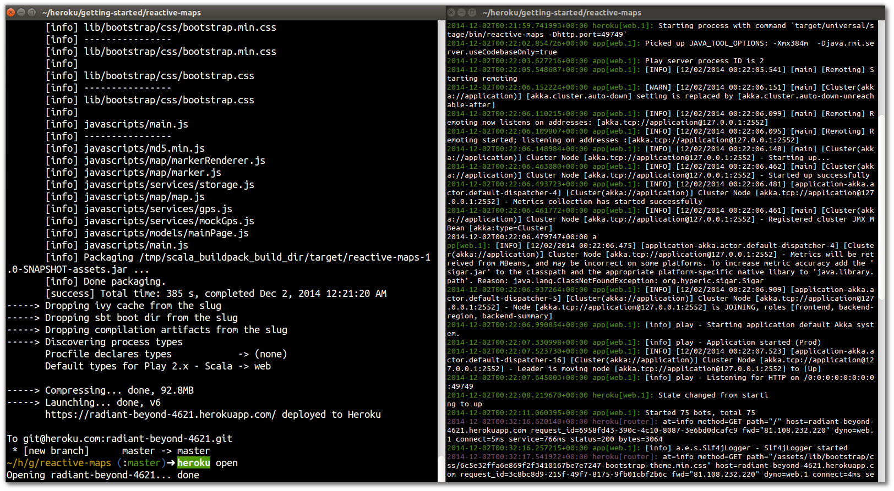

# Real-time Logs 

  Watching the logs in real time is a good way to understand what is happening with your application, especially during key points of the develoment cycle.  For example:
  
  * Deploying a new version of the code
  * Scaling the application 
  * Changing a configuration variable
  * Provisioning a new addon for your app
  * Running a script on the server (eg, database update script)
  
  You can see the real time logs of your application at any time using the `heroku logs` command, however Heroku will only show you the logs at that time.
  
  It is common to open another terminal window with the heroku logs continually running.  This can be done using the `--tail` option.

```  
heroku logs --tail
```


